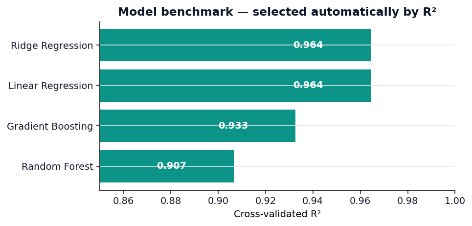
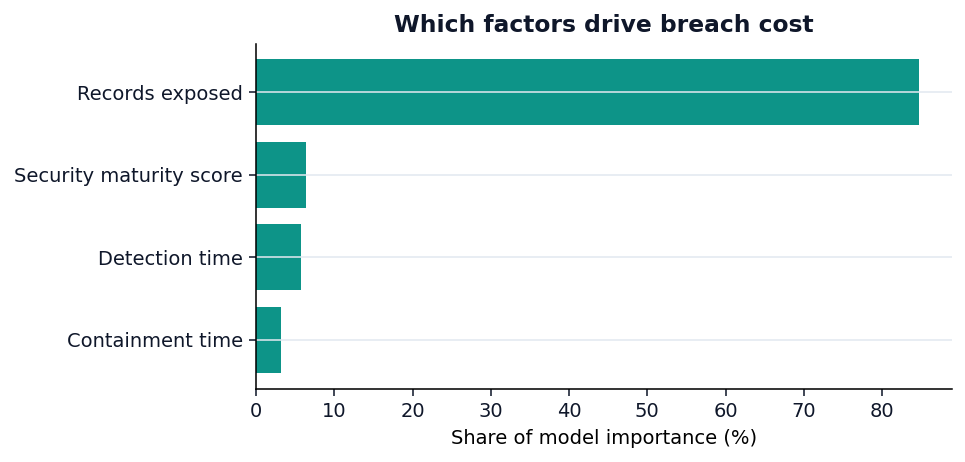
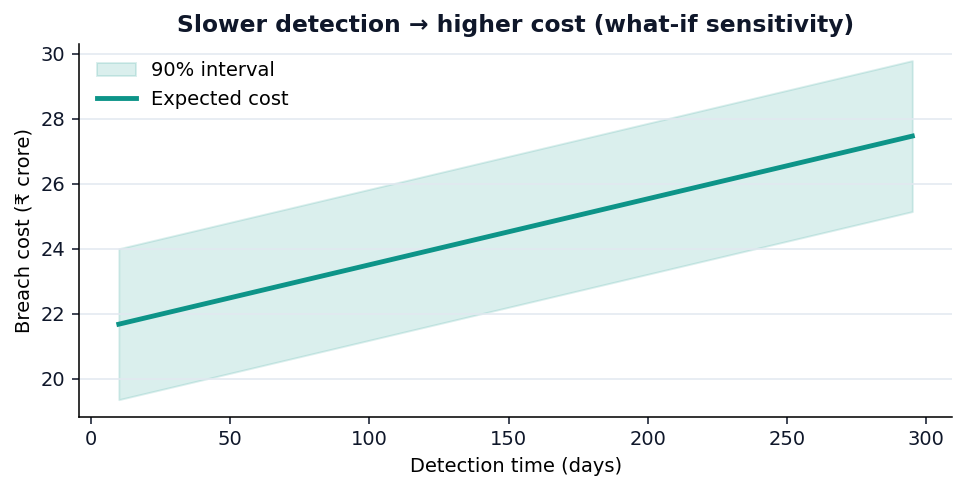

<div align="center">

# 🛡️ BreachLens

### Open-source cyber breach **cost & risk quantification** engine

*Estimate what a data breach would cost your organisation — with an honest uncertainty band — and prove which security investments actually pay for themselves.*

[](https://github.com/leonkaushikdeka/breachlens/actions/workflows/ci.yml)
[](https://www.python.org/)
[](LICENSE)
[](https://github.com/astral-sh/ruff)
[](#-live-demo)

</div>

---

## Why this exists

Boards approve security budgets in money, but most security teams can only argue in
abstractions ("we reduced dwell time", "our maturity improved"). **Cyber Risk
Quantification (CRQ)** closes that gap by translating security posture into expected
financial loss. The problem: the tools that do this — RiskLens (FAIR), Kovrr,
SafeBreach — are expensive enterprise SaaS and effectively black boxes.

**BreachLens is a small, transparent, open-source take on CRQ.** Give it four
measurable factors and it returns a calibrated breach-cost estimate, a confidence
interval, an explanation of the drivers, and a what-if simulator that turns
"invest in faster detection" into a rupee figure.

> Built from a university ML project ([original report](docs/report)) and grown into
> a real, deployable product: a Python package, an interactive web app, a REST API
> and a CLI.

---

## ✨ What it does

| | |
|---|---|
| 📈 **Cost prediction** | Estimate breach cost from records exposed, detection time, containment time and security maturity. |
| 🎯 **Honest uncertainty** | A point estimate alone is not credible — every prediction ships with a **split-conformal** interval (distribution-free, no Gaussian hand-waving). |
| 🧪 **What-if simulator** | "Cut detection from 200 → 100 days ⇒ save ₹X crore." The feature that makes it a *decision tool*, not just a predictor. |
| 🔍 **Explainability** | Permutation importance (global) + per-prediction contribution waterfall (local). |
| 🤖 **Model benchmark** | Four algorithms cross-validated; the strongest by R² is selected automatically. |
| 💱 **Region-aware** | India / ₹ crore by default, configurable for other locales. |
| 🧩 **Four ways to use it** | Python library · Streamlit app · FastAPI service · CLI. |

---

## 🚀 Live demo

The Streamlit app is built to deploy free on **Streamlit Community Cloud**.
Point it at `streamlit_app.py` — see [Deployment](#-deployment).

> _Add your deployed URL here once live, e.g._ `https://breachlens.streamlit.app`

<div align="center">





</div>

---

## ⚡ Quickstart

```bash
git clone https://github.com/leonkaushikdeka/breachlens.git
cd breachlens
pip install -e ".[dev,app,api]"
```

### Run the web app

```bash
streamlit run streamlit_app.py     # → http://localhost:8501
```

### Use the CLI

```bash
breachlens benchmark               # cross-validate the model zoo
breachlens train                   # train + persist the best model

breachlens predict --records 300 --detection 200 --response 90 --security 40
# Expected breach cost: ₹23.53 crore
# 90% interval: ₹21.20 crore – ₹25.85 crore

breachlens whatif --records 300 --detection 200 --response 90 --security 40 \
    --improve detection_time=100 --improve security_score=70
# Baseline expected cost : ₹23.53 crore
# Adjusted expected cost : ₹18.83 crore
# This change saves ₹4.70 crore (+20.0%).
```

### Use the Python API

```python
from breachlens import BreachLens, BreachProfile

lens = BreachLens.load_or_train()        # trains in-memory if no saved model
profile = BreachProfile(
    records_exposed=300, detection_time=200, response_time=90, security_score=40
)

result = lens.predict(profile)
print(lens.format(result.expected_cost))            # ₹23.53 crore
print(lens.format(result.lower), "–", lens.format(result.upper))

scenario = lens.what_if(profile, {"detection_time": 100, "security_score": 70})
print(f"Saves {lens.format(scenario.savings)} ({scenario.savings_pct:.0%})")
```

### Run the REST API

```bash
uvicorn api.main:app --reload        # docs at http://localhost:8000/docs
```

```bash
curl -X POST localhost:8000/predict \
  -H "Content-Type: application/json" \
  -d '{"records_exposed":300,"detection_time":200,"response_time":90,"security_score":40}'
```

---

## 🧠 How it works

**1 · Model selection.** BreachLens doesn't assume linear regression is best — it
benchmarks Linear, Ridge, Random Forest and Gradient Boosting with 5-fold
cross-validation and picks the strongest by R². On the bundled data the relationship
is genuinely linear, so **regularised linear regression wins (R² ≈ 0.96)** *and* stays
interpretable — a good outcome for a domain where decisions must be explained.

**2 · Uncertainty via split conformal prediction.** A calibration split the model
never trained on yields absolute residuals; their conformal quantile becomes the ±
band. This gives a finite-sample coverage guarantee without assuming a noise
distribution. ([Lei et al., 2018](https://arxiv.org/abs/1604.04173))

**3 · Explainability.** Permutation importance answers *"which factors drive cost
overall?"*; a local contribution decomposition answers *"why is **this** estimate
high?"* and powers the waterfall chart.

**4 · Decision support.** The what-if engine re-scores a profile under a target
posture and reports the cost delta, with an optional risk-adjusted ROI calculation.

---

## 🗂️ Project structure

```
breachlens/            # core library
├── config.py          # feature schema + region/currency presets
├── schema.py          # validated input/output models (pydantic)
├── data.py            # dataset loading + validation
├── synth.py           # transparent synthetic data generator
├── models.py          # model zoo, benchmark, train, persistence
├── intervals.py       # split conformal prediction
├── explain.py         # permutation importance + local contributions
├── scenario.py        # what-if simulator + ROI
├── predictor.py       # high-level facade (BreachLens)
└── cli.py             # command-line interface
app/ui.py              # Streamlit application
api/main.py            # FastAPI service
streamlit_app.py       # Streamlit Cloud entrypoint
data/                  # dataset + data dictionary
tests/                 # pytest suite (92% coverage)
```

---

## 📊 The dataset (and an honest disclaimer)

Real per-company breach costs are confidential and unpublished, so BreachLens ships a
**synthetic** dataset of 200 Indian-company breaches, calibrated to the magnitudes in
the IBM *Cost of a Data Breach* report for India (real average ≈ ₹19.5 crore; this
data centres near ₹17.5 crore). The generative model is **fully documented and
regenerable** — there is no hidden "magic" dataset:

```bash
breachlens generate-data --n 500 --seed 7 --out data/extra.csv
```

See [`data/DATA_DICTIONARY.md`](data/DATA_DICTIONARY.md) for column definitions and
provenance.

> ⚠️ **Estimates are directional decision-support, not actuarial figures.** Do not use
> BreachLens as the sole basis for insurance or financial decisions.

---

## 🌐 Deployment

### Streamlit Community Cloud (free)

1. Push this repo to GitHub.
2. Go to [share.streamlit.io](https://share.streamlit.io) → **New app**.
3. Select the repo, branch `main`, main file **`streamlit_app.py`**.
4. Deploy. Dependencies install from `requirements.txt` automatically.

### Docker

```bash
docker compose up           # app → :8501, api → :8000
```

---

## 🛠️ Tech stack

`scikit-learn` · `pandas` · `numpy` · `pydantic` · `Streamlit` · `Plotly` ·
`FastAPI` · `joblib` · `pytest` · `ruff` · `mypy` · `GitHub Actions` · `Docker`

## 🧪 Development

```bash
make dev      # editable install with all extras
make test     # pytest
make cov      # coverage report
make lint     # ruff
make type     # mypy
make figures  # regenerate README charts
```

---

## 🗺️ Roadmap

- [ ] Bring-your-own-CSV training from the web app
- [ ] SHAP explainer as a first-class panel (`pip install breachlens[explain]`)
- [ ] FAIR-aligned loss-event-frequency × magnitude decomposition
- [ ] Monte-Carlo annualised-loss-expectancy (ALE) view
- [ ] Calibration plot + coverage report in the model card

## 🤝 Contributing

Issues and PRs welcome — see [CONTRIBUTING.md](CONTRIBUTING.md).

## 📄 License

[MIT](LICENSE) © Leon Kaushik Deka
