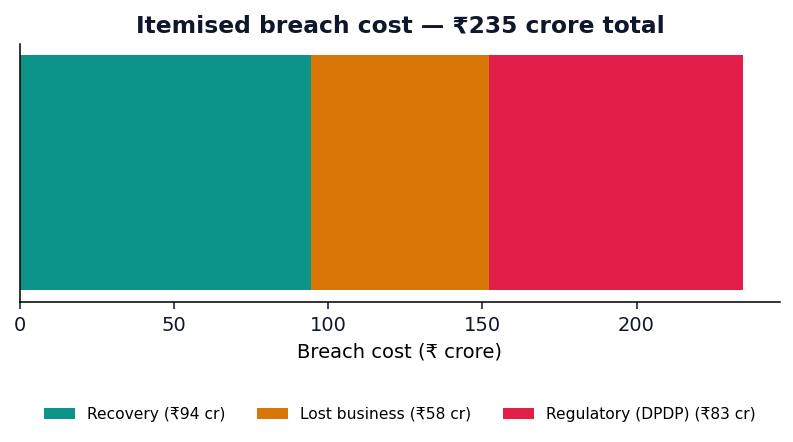
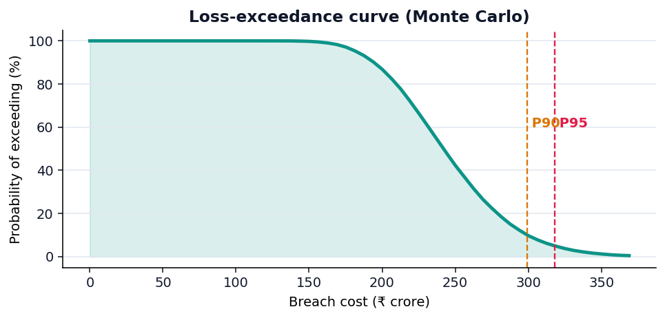
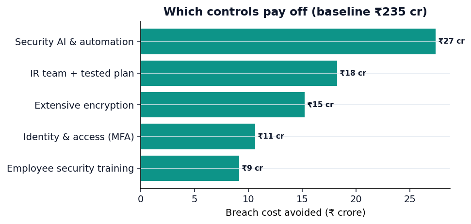

<div align="center">

# 🛡️ BreachLens

### Data breach **cost predictor** & cyber-risk quantification engine

*What would a data breach actually cost your organisation? BreachLens answers in money — grounded in real IBM industry benchmarks and Indian/EU regulatory penalties, with Monte Carlo uncertainty and a security-investment ROI simulator.*

[](https://github.com/leonkaushikdeka/breachlens/actions/workflows/ci.yml)
[](https://www.python.org/)
[](LICENSE)
[](https://github.com/astral-sh/ruff)
[](#-live-demo)

</div>

---

## The problem it solves

Boards approve security budgets in money, and India's **DPDP Act 2023** now carries
fines of up to **₹250 crore** per breach — but most security teams still can't answer
*"what would a breach cost us?"* with a defensible number. The tools that do this
(RiskLens, Kovrr) are expensive enterprise SaaS and effectively black boxes.

**BreachLens is a transparent, open-source breach-cost estimator** a CISO, vCISO,
consultant, or compliance officer can actually use:

- It does **not** invent a number from a black-box model. Every step is a cited,
  auditable transformation of **published industry figures** (IBM *Cost of a Data
  Breach*) plus the **real regulatory penalty schedules** (DPDP, GDPR).
- It reports a **distribution**, not false precision — *"expected ₹120 cr, but a 1-in-20
  breach exceeds ₹190 cr"* — via Monte Carlo, the same shape of output the FAIR risk
  standard uses.
- It turns the estimate into a **business case**: *"invest ₹4 cr in security AI +
  encryption → cut expected breach cost ₹30 cr → 0.6-year payback."*

---

## ✨ What it does

| | |
|---|---|
| 💰 **Itemised cost estimate** | Recovery + lost business + **regulatory fine**, by industry and jurisdiction. |
| 📚 **Grounded in real data** | Per-record cost, time-to-contain effect, and industry multipliers from IBM CODB 2024 — every constant cited and overridable. |
| ⚖️ **Real regulatory teeth** | DPDP Act 2023 (₹250 cr cap), GDPR (€20M / 4% turnover), US per-record exposure. |
| 🎲 **Honest uncertainty** | Monte Carlo → expected, P50/P90/P95, and a **loss-exceedance curve**. |
| 🛠️ **Investment ROI** | Each security control maps to a published IBM cost factor; get savings, ROI, and payback. |
| 📄 **Board-ready report** | One-click export to Markdown / printable HTML (→ PDF) for boards and clients. |
| 🤖 **Optional ML second opinion** | Train a scikit-learn model on *your own* breach data; the bundled synthetic set is a labelled demo seed only. |
| 🧩 **Four ways to use it** | Python library · Streamlit app · FastAPI service · CLI. |

---

## 🚀 Live demo

The Streamlit app is built to deploy free on **Streamlit Community Cloud** — main file
`streamlit_app.py`. See [Deployment](#-deployment).

> _Add your deployed URL here once live, e.g._ `https://breachlens.streamlit.app`

<div align="center">





</div>

---

## ⚡ Quickstart

```bash
git clone https://github.com/leonkaushikdeka/breachlens.git
cd breachlens
pip install -e ".[dev,app,api]"
```

### Web app

```bash
streamlit run streamlit_app.py        # → http://localhost:8501
```

### CLI

```bash
breachlens estimate --records 350 --detection 220 --response 95 --security 45 \
    --industry healthcare --jurisdiction IN
#   Recovery        : ₹112.41 crore
#   Lost business   : ₹68.90 crore
#   Regulatory fine : ₹72.29 crore
#   TOTAL           : ₹253.61 crore

breachlens simulate --records 350 --detection 220 --response 95 --security 45
#   Expected (mean): ... | P90: ... | P95 (tail risk): ...

breachlens invest --records 350 --detection 220 --response 95 --security 45 \
    --controls security_ai_automation,encryption --investment 4
#   Gross savings ... | ROI 0.60× | payback 0.6 yr

breachlens penalty --records 350 --jurisdiction IN --severity 0.4
breachlens controls            # list the security control catalogue
breachlens report --records 350 --detection 220 --response 95 --security 45 \
    --format html --out report.html    # board-ready report (open → print to PDF)
```

### Python API

```python
from breachlens import BreachLens, OrgProfile, Industry, Jurisdiction

lens = BreachLens()
org = OrgProfile(
    records_exposed=350, detection_time=220, response_time=95, security_score=45,
    industry=Industry.FINANCIAL, jurisdiction=Jurisdiction.IN, regulatory_severity=0.4,
)

cost = lens.estimate(org)
print(cost.format(cost.total))                    # ₹... crore  (recovery + business + fine)

mc = lens.simulate(org)
print(mc.format(mc.p90))                           # 90th-percentile breach cost

case = lens.investment_case(org, ["security_ai_automation", "ir_team_and_plan"], investment=4.0)
print(cost.format(case.gross_savings), f"saved · ROI {case.roi:.1f}x")
```

### REST API

```bash
uvicorn api.main:app --reload        # docs at http://localhost:8000/docs
curl -X POST localhost:8000/estimate -H "Content-Type: application/json" \
  -d '{"profile":{"records_exposed":350,"detection_time":220,"response_time":95,"security_score":45,"industry":"financial","jurisdiction":"IN"}}'
```

---

## 🧠 How it works

**1 · Transparent cost model (not a black box).** The estimate is an explicit,
auditable transformation of published figures:

```
operational = regional average breach cost          (IBM CODB, by jurisdiction)
            × size factor       (records, sub-linear — mega-breaches cost less per record)
            × industry multiplier                    (IBM: healthcare highest)
            × lifecycle multiplier   (detection + containment days, pivot at 200)
            × security-posture multiplier            (net of IBM mitigators/amplifiers)
            × control factor    (extra investments, each an IBM cost factor)

total = operational  (recovery + lost business)  +  regulatory penalty
```

**2 · Regulatory penalty models.** DPDP Act 2023 (India, up to ₹250 cr), GDPR
(€20M / 4% of turnover), and US per-record exposure — scaled by breach size and an
estimated severity, capped at the statutory maximum.

**3 · Monte Carlo uncertainty.** Sampling the regional average, a residual shock, and
regulatory severity yields a cost **distribution** and the **loss-exceedance curve** —
the headline view boards and insurers plan capital against.

**4 · Investment ROI.** Each control in the catalogue maps to a published IBM cost
factor. The simulator recomputes the estimate with the control applied and reports
gross savings, risk-adjusted savings, ROI, and payback.

**5 · Optional ML second opinion.** `breachlens train` fits and benchmarks scikit-learn
models (with split-conformal intervals) on real breach data you supply. The bundled
synthetic dataset is clearly a demo seed — never the basis of the headline estimate.

> ⚠️ **Decision-support estimates, not actuarial or legal figures.** All constants are
> illustrative reference points from public reports and are overridable. Do not use as
> the sole basis for insurance, financial, or legal decisions.

---

## 🗂️ Project structure

```
breachlens/
├── benchmarks.py    # cited IBM/DBIR knowledge base + jurisdictions + industries
├── penalties.py     # DPDP Act 2023 / GDPR / US penalty models
├── controls.py      # security control catalogue → IBM cost factors
├── cost_model.py    # transparent benchmark-driven estimator (the core)
├── montecarlo.py    # cost distribution + loss-exceedance curve
├── scenario.py      # what-if + security-investment ROI
├── predictor.py     # BreachLens facade
├── schema.py        # validated OrgProfile (pydantic)
├── models.py        # optional ML second opinion (model zoo + conformal intervals)
└── cli.py           # command-line interface
app/ui.py            # Streamlit application
api/main.py          # FastAPI service
tests/               # pytest suite (92% coverage)
```

---

## 🌐 Deployment

**Streamlit Community Cloud (free):** push to GitHub →
[share.streamlit.io](https://share.streamlit.io) → New app → main file
`streamlit_app.py`. Dependencies install from `requirements.txt`.

**Docker:** `docker compose up` → app on `:8501`, API on `:8000`.

---

## 🛠️ Tech stack

`scikit-learn` · `numpy` · `pandas` · `pydantic` · `Streamlit` · `Plotly` ·
`FastAPI` · `joblib` · `pytest` · `ruff` · `mypy` · `GitHub Actions` · `Docker`

```bash
make dev    # editable install + extras
make cov    # tests with coverage
make lint   # ruff      make type   # mypy      make figures  # regenerate charts
```

---

## 🗺️ Roadmap

- [ ] Bring-your-own benchmark overrides from the web app (custom per-record cost)
- [ ] Full FAIR decomposition (Loss Event Frequency × Loss Magnitude)
- [ ] Annualised Loss Expectancy (ALE) view across a control portfolio
- [x] Exportable board-ready report (Markdown / printable HTML)
- [ ] CIS Controls v8 / NIST CSF 2.0 guided maturity assessment

## 🤝 Contributing

Issues and PRs welcome — see [CONTRIBUTING.md](CONTRIBUTING.md).

## 📄 License

[MIT](LICENSE) © Leon Kaushik Deka · Grew out of a university project on data breach
cost prediction ([report](docs/report)).
